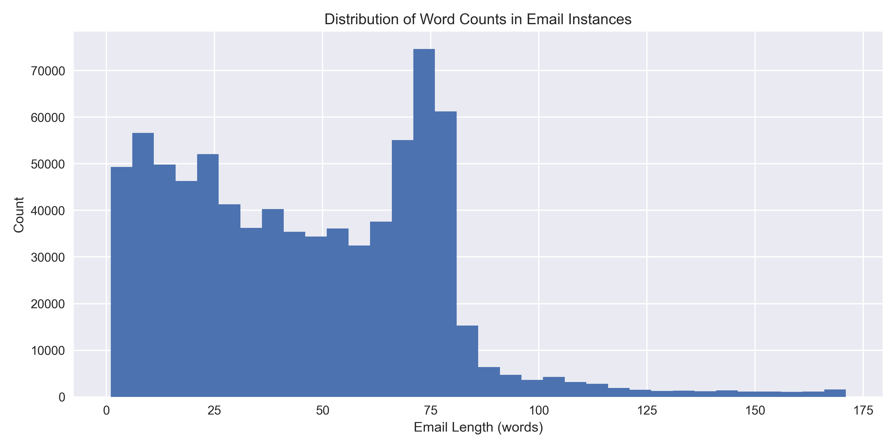
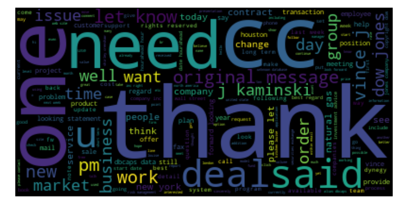
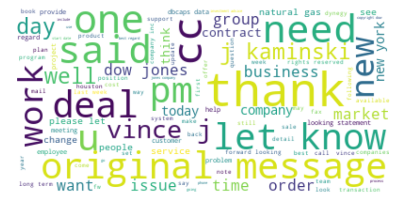
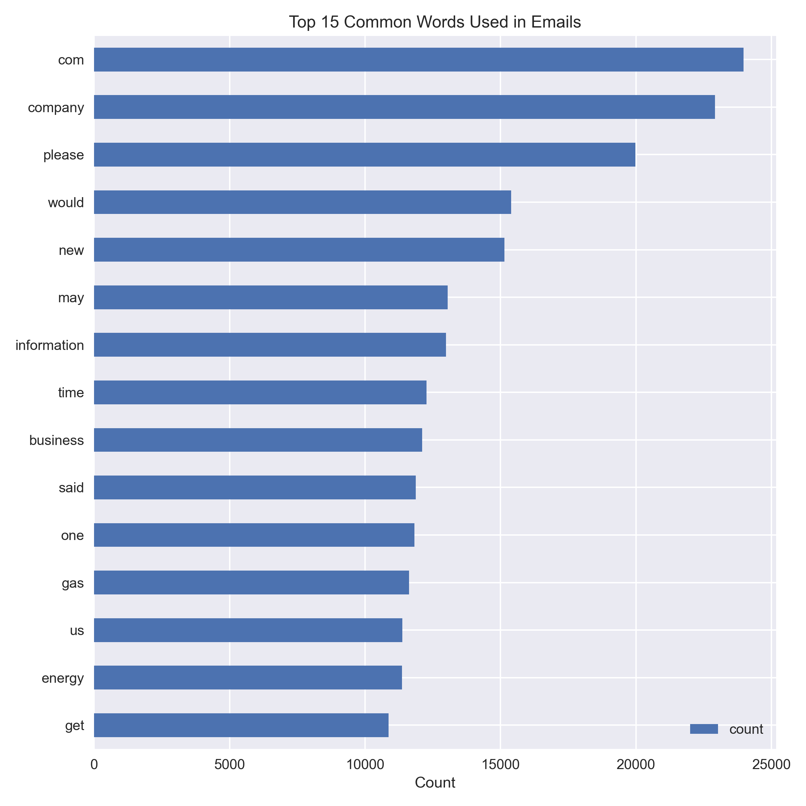
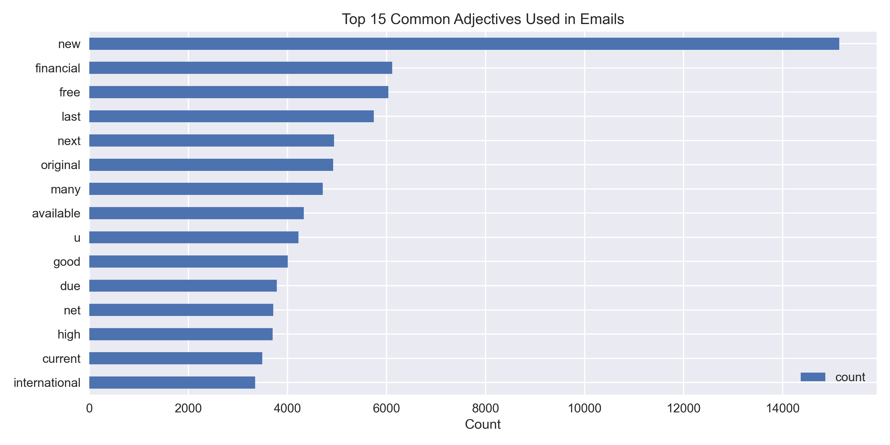
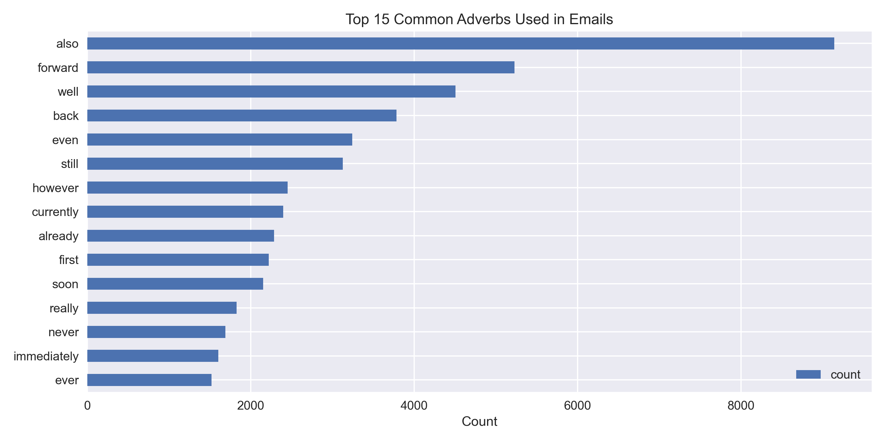

# Predicting Enron Spam Emails using Supervised Learning

## Project Name

Predicting Enron Spam Emails (Junk Messages) using Supervised Learning

## Team

Team Name: **A3SR**

Team Members:

- [Jiejie Wang](https://github.com/jw6190)
- [Tong Jin](https://github.com/tong-jin-nyu)
- [Zixuan Zhou](https://github.com/timzhou1009)

## Description

This project applies supervised machine learning techniques to build a spam email classifier which automatically detects spam emails (junk messages). It is the final project of the [DS-GA 1001: Introduction to Machine Learning](https://github.com/briandalessandro/DataScienceCourse) course at New York University.

## Data

The data are acquired from the "preprocessed subdirectory" of the [Enron-Spam datasets](http://www2.aueb.gr/users/ion/data/enron-spam/). The "preprocessed" subdirectory contains the email messages in the preprocessed format. Each email instance is in a separate text file.

## Business Problem

Spam electric males have become a serious issue in today's online world. Spam mails are junk or unsolicited messages designed and distributed for commercial purposes. Email spam not only negatively affects customer experience. It also wastes limited internet resources. A major email service provider is suffering from high-level email spam. The company is constantly losing customers. Users report that they receive too many spam emails daily. The company wants to design a classifier to filter the spam emails out from the users and to prevent potential financial losses.

## Use Scenario

Using machine learning techniques to train a classifier that automatically identifies and filters spam emails for users.

## Trained Models

1. Logistic regression with elastic net (Baseline)

2. Random Forest

3. Gradient Boosting Machine

4. Multilayer Perceptron

## Grading

We use AUC (Area Under the ROC Curve) scores to measure model performance. Additionally, we apply confusion matrix to visualize model accuracy.

## File Structure

- folder: `data`: all data files are stored in this folder
  - folder: `raw`: original data files downloaded from [Enron Spam Data Warehouse](http://www2.aueb.gr/users/ion/data/enron-spam/)
- dev: `script`: all project related scripts are stored in this folder

## Exploratory Data Analysis

*For details, please read the full EDA report.*

## Results

Results pending.

## Reference

Metsis, I. Androutsopoulos and G. Paliouras, ["Spam Filtering with Naive Bayes - Which Naive Bayes?"](http://www2.aueb.gr/users/ion/docs/ceas2006_paper.pdf). Proceedings of the 3rd Conference on Email and Anti-Spam (CEAS 2006), Mountain View, CA, USA, 2006.
